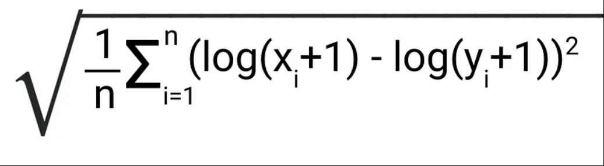
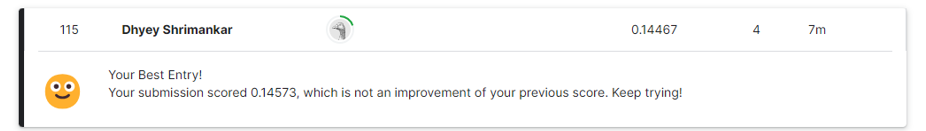

# Abalone Age Prediction - Kaggle Playground Series 🐚🔮

## Introduction 🌊

This competition invites you to explore the fascinating world of abalones and test your machine learning prowess. By predicting the age of abalones accurately, you'll unlock insights into these marine mollusks and their growth patterns.

## **Objective** 🎯

Your mission is to develop robust machine learning models capable of accurately predicting the age of abalones based on their physical attributes.

## **Evaluation** 📊

Your submissions will be evaluated using the **Root Mean Squared Logarithmic Error (RMSLE)** metric. This metric ensures your predictions are as close as possible to the true values while penalizing large errors.

    

## **My Score** 📊

Ranked 115 out of 2600 with a score of 0.14467

    

## Dataset 📦

The dataset for this competition includes various physical measurements of abalones, such as length, diameter, height, and weight. These features serve as valuable indicators of abalone age.

### Background
 - This dataset comes from an original (non-machine-learning) study and received in December 1995:
    - Warwick J Nash, Tracy L Sellers, Simon R Talbot, Andrew J Cawthorn and Wes B Ford (1994)
    - "The Population Biology of Abalone (_Haliotis_ species) in Tasmania. I. Blacklip Abalone (_H. rubra_) from the            North Coast and Islands of Bass Strait",
    - Sea Fisheries Division, Technical Report No. 48 (ISSN 1034-3288).
    - Dataset can be found on [UIC Machine learning repository site](https://archive.ics.uci.edu/ml/datasets/Abalone)
    - **Citation:**
        - There are more than 30 papers that cites this data set. Please find the full list at [UIC Machine learning repository site](https://archive.ics.uci.edu/ml/datasets/Abalone) 

### Description
 - From the original data examples with missing values were removed (the majority having the predicted value missing),    and the ranges of the continuous values have been scaled for use with an ANN (by dividing by 200). For the purpose    of this analysis, we will scale those variables back to its original form by multiplying by 200.
 
 - Total number of observations in dataset: **4176**
 - Total number of variables in dataset : **8**
 
 - Metadata and attribute information:
    - Given is the attribute name, attribute type, the measurement unit and a brief description.  The number of rings is      the value to predict as a continuous value.
   
### Variable List
   | Name   |      Data Type      |  Measurement | Description |
   |----------|:-------------|:------| :-----------|
   | Sex |  categorical (factor) |  |  M, F, and I (Infant)  |
   | Length |  continuous	 | mm |  Longest shell measurement  |
   | Diameter |  continuous	 | mm | perpendicular to length  |
   | Height |  continuous	 | mm |  with meat in shell  |
   | Whole weight |  continuous	 | grams	 |  whole abalone  |
   | Shucked weight |  continuous	 | grams	 |  weight of meat  |
   | Viscera weight	 |  continuous	 | grams	 |  gut weight (after bleeding)  |
   | Shell weight |  continuous	 | grams	 |  after being dried  |
   | Rings |  continuous	 |  | +1.5 gives the age in years  |

## Files 📄

- **train.csv**: Training dataset containing abalone measurements and their corresponding ages.
- **test.csv**: Test dataset for which you need to predict the abalone ages.
- **sample_submission.csv**: A sample submission file demonstrating the correct format for predictions.

### 🐚✨ **Author**:-
### [Linkedin](https://www.linkedin.com/in/dhyey-shrimankar-298855247/)
### [GitHub](https://github.com/Dhyey3187)

